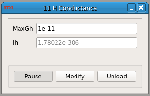

###H+ Current

**Requirements:** None  
**Limitations:** None  

<!--start-->
This program simulates the current caused by an H current in the cell. The parameters are taken from Dickson, Magistretti, Shalinsky, Fransen, Hasselmo and Alonso, Properties and Role of Ih in the pacing of subthreshold oscillations in entorhinal cortex layer II Neurons, J. Neurophysiol. 83:2562-2579, 2000.
<!--end-->

####Input Channels:
1. input(0) - Vin : the voltage of the cell to which Ih is to be added

####Output Channels:
1. output(0) - Iout : current output

####Parameters:
1. MaxGh - max h conductance (S)

####States:
1. Ih - current output (displays output(0) in the GUI)
